# Front End

The following images show our front end, which we developed using React.js and Bootstrap.

1. Login Page  
2. Home Page 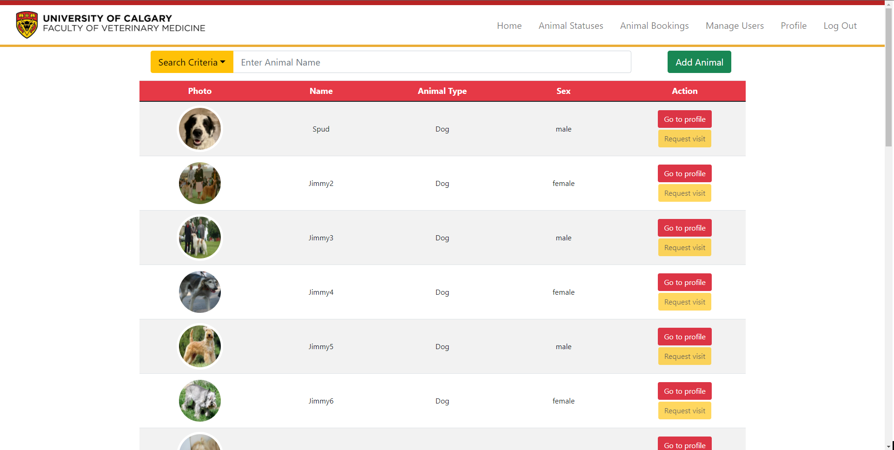 
3. User Profile Page 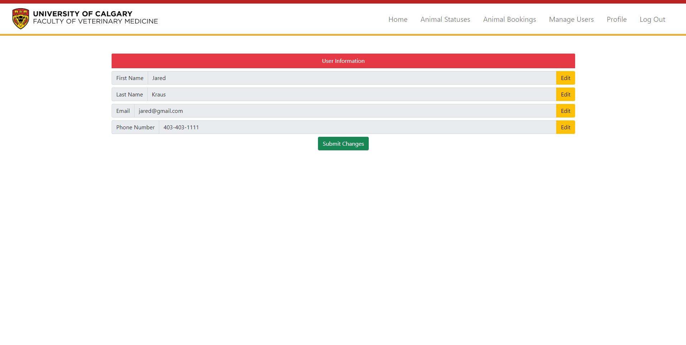 
4. Animal Profile Page: medical issues tab 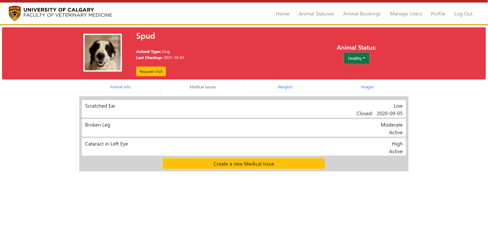 
5. Animal Profile Page: animal info tab 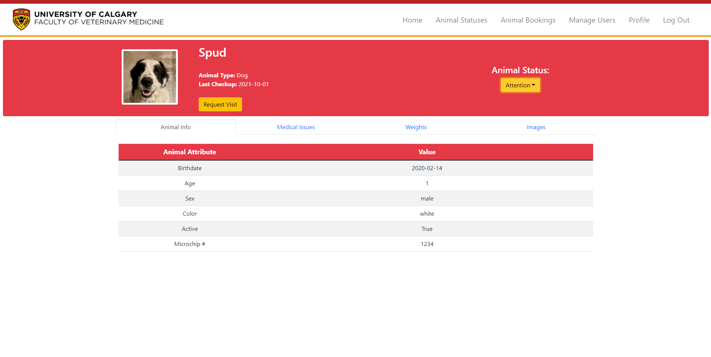 
6. Animal Profile Page: images tab 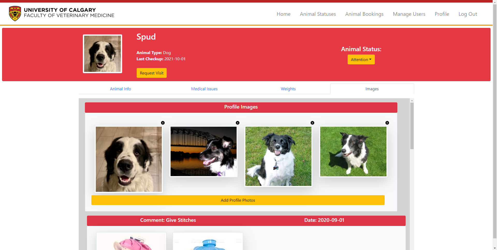 
7. Animal Profile Page: weight history tab 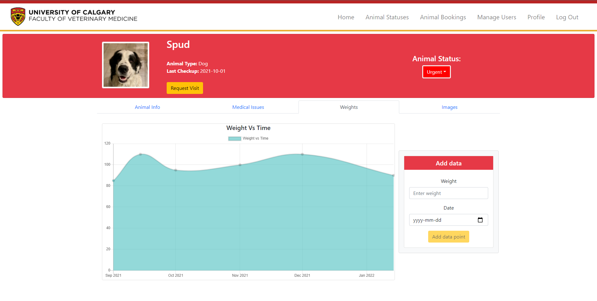 
8. Animal Medical Issue Page: 
   1. This page gives details on an individual medical issue the animal has had 
   2. Ex. if an animal broke its leg 
   3. All the treatments corresponding to this issue can be found here 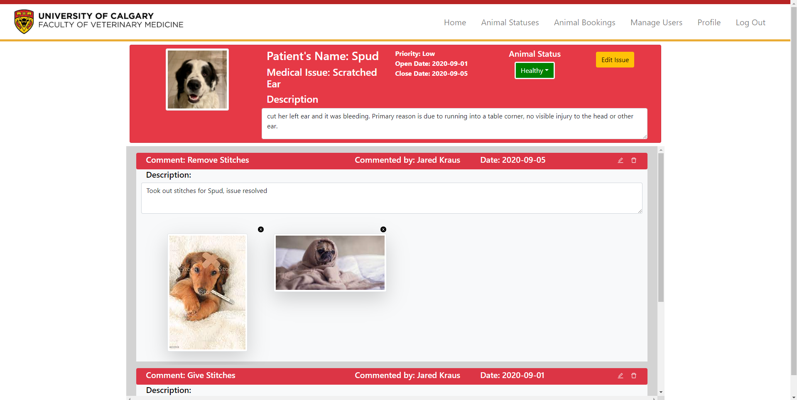 
9. Animal Class visit Dashboard 
   1. this dashboard is used to schedule animals for classroom visits 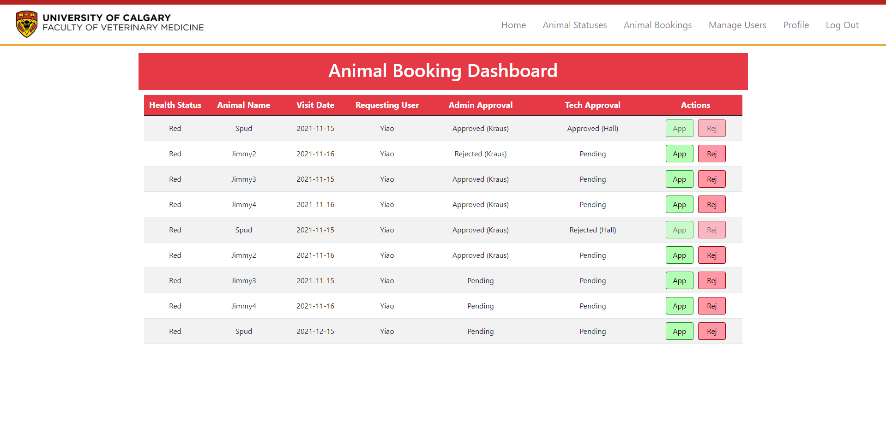 
10. User Management Dashboard 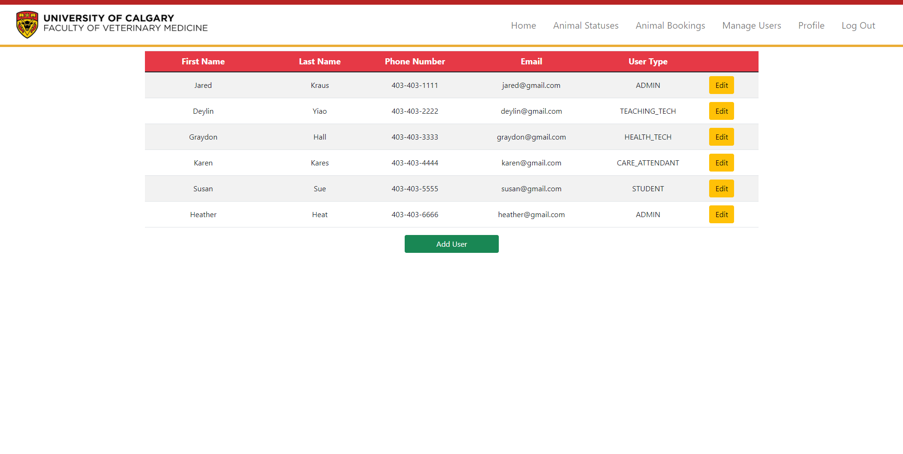 
11. Animal Status Dashboard 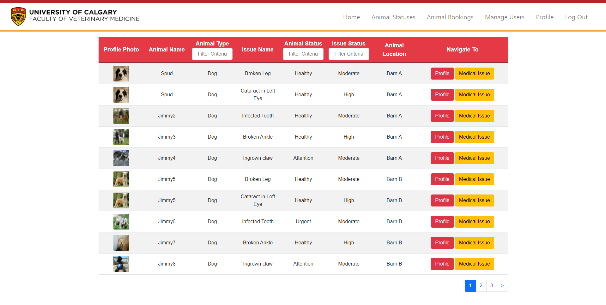 

12. Comment Form 
    1. this is used to add a specific comment for an animal's medical issue 
    2. ex. Giving an animal a checkup, to check on their broken leg 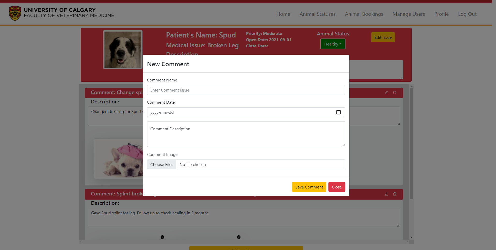 
13. Individual Medical issue form 
    1. Used to create a new medical issue 
    2. Ex. you'd open a new issue if an animal broke their leg 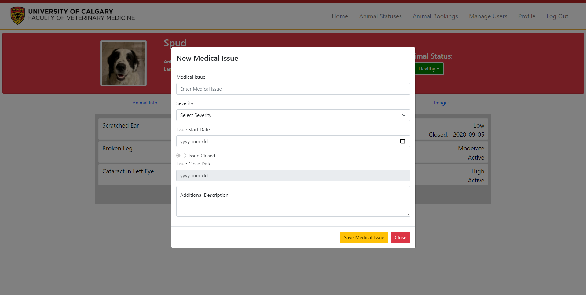 
14. Classroom booking request form 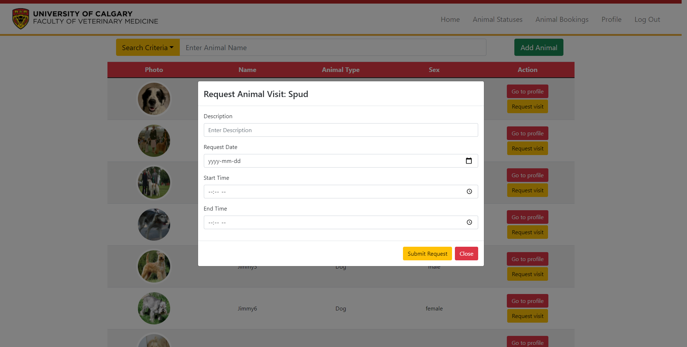 
15. Add a new animal form 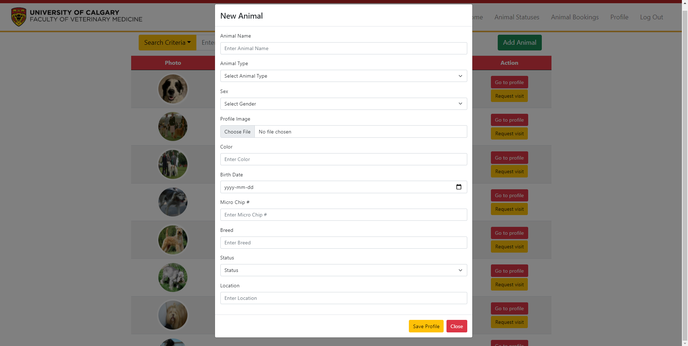 
16. Add a new user form 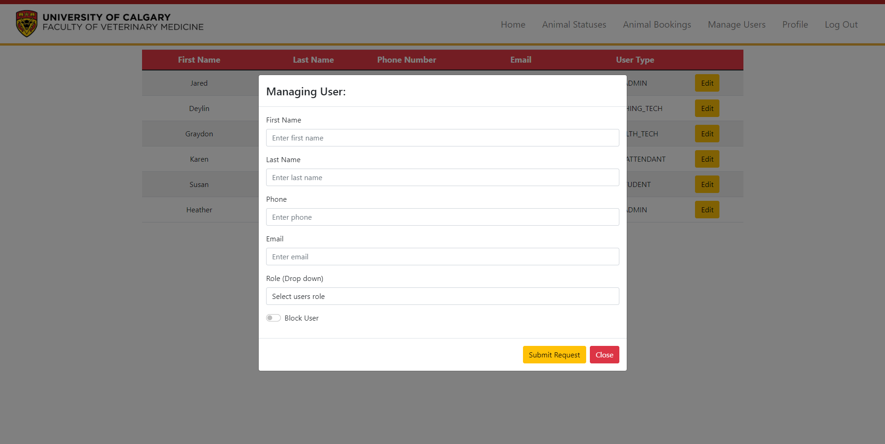 
